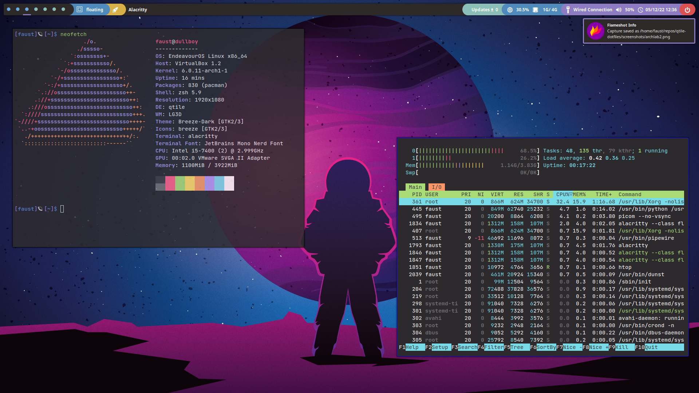
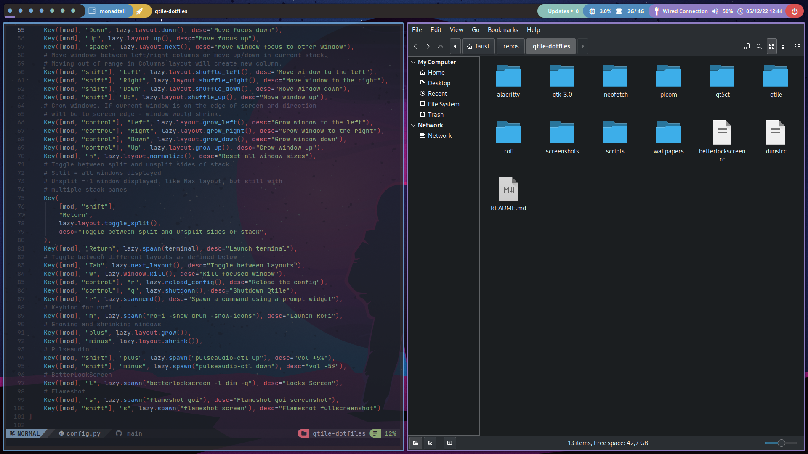

# Qtile dotfiles

My first Arch Linux custom desktop, made from scratch with QtileWM.
If you want to use these dotfiles, please keep in mind that you need every package installed.
I will keep on adding commits to this repo as I change stuff in my personal desktop.
Feel free to change any config file to your heart's content.

Note: The display server I use is Xorg, none of this has been tested on Wayland


## Packages needed

Fonts used are:
  - JetBrains Mono Nerd Font

Dependencies:
  - qtile
  - qtile-extras
  - zsh
  - zsh-completions
  - alacritty
  - rofi
  - pulseaudio-ctl
  - feh
  - picom
  - betterlockscreen
  - flameshot

If you are using an Arch based distro you can install these using your favourite AUR helper:

```bash
paru -S qtile qtile-extras alacritty rofi pulseaudio-ctl feh picom betterlockscreen flameshot nerd-fonts-jetbrains-mono zsh zsh-completions
```

Qtile uses some third-party libraries that you will also need to install using pip:

```bash
pip install dbus-next iwlib
```

## Login

If logging in from the tty is not your thing, you may want to check some login manager. I use sddm with an astronaut theme (https://github.com/joe733/sddm-theme-astronaut).


## Keybinds

### Keyboard

+ `mod + enter` : Spawn terminal
+ `mod + arrows` : Change window focus
+ `mod + shift + arrows` : Move window
+ `mod + tab` : Toggle layouts
+ `mod + w` : Kill focused window
+ `mod + control + r` : Reload Qtile
+ `mod + control + q` : Shutdown Qtile
+ `mod + m` : Launch Rofi
+ `mod + "plus"` : Grow window (Tiling layouts only)
+ `mod + "minus"` : Shrink  window (Tiling layouts only)
+ `mod + shift + "plus"` : Pulseaudio volume +5%
+ `mod + shift + "minus"` : Pulseaudio volume -5%
+ `mod + l` : Lock screen 
+ `mod + [1-5]` : Switch between workspaces
+ `mod + s` : Select screenshot area
+ `mod + shift + s` : Full screenshot 


### Mouse

+ `mod + LeftClick`: Drag window (Converts it into floating window)
+ `mod + RightClick`: Resize window (Converts it into floating window)
+ `mod + CenterClick`: Bring window to front 
+ `Scroll (on the volume module)`: Pulseaudio volume +-5%


## BetterLockScreen

In order to use betterlockscreen you will need to update its cache with the image you want to use.
You can also specify a directory with a few images in it and betterlockscreen will randomly choose one to update.
To do this use this command:
```bash
betterlockscreen -u <path>
```
To lock the screen from a terminal you can use:
```bash
betterlockscreen -l <effect> -q
```
But I already set a keybind in config.py. Just do [mod] + l

You will also need to enable the service if you want it to lock the screen when the system sleeps/suspends.
First copy the .service file to /usr/lib/systemd/system/ (The AUR package does this for you)
```bash
cp betterlockscreen@.service /usr/lib/systemd/system/
```
Then enable the service:
```bash
sudo systemctl enable betterlockscreen@$USER.service
```

For more info check their repository: https://github.com/betterlockscreen/betterlockscreen

## Shoutouts
  - NvChad: https://github.com/NvChad/NvChad
  - zsh4humans: https://github.com/romkatv/zsh4humans
